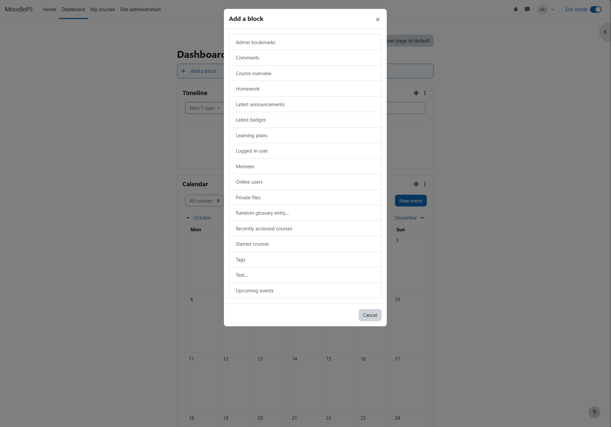
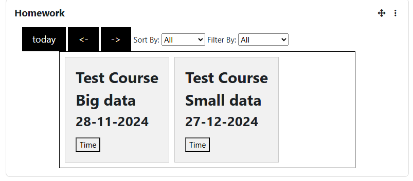
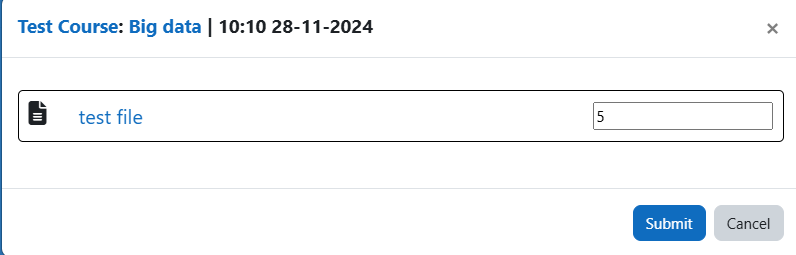
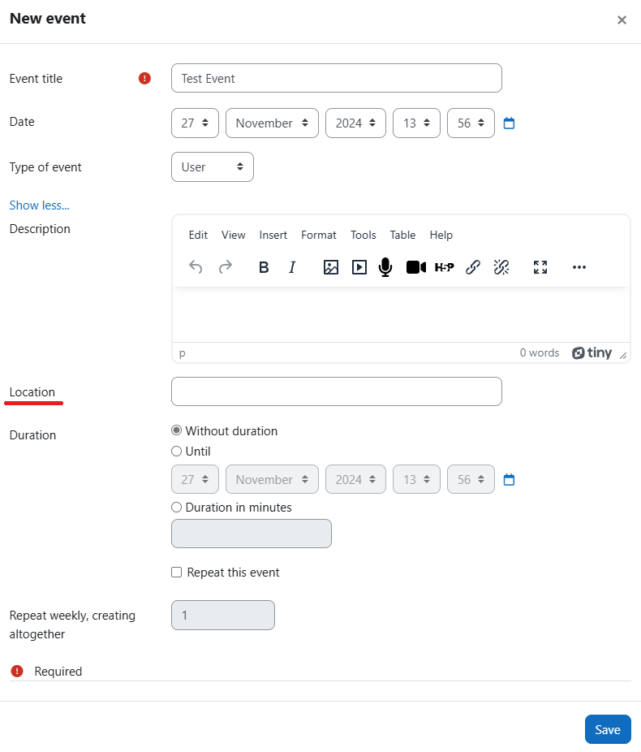
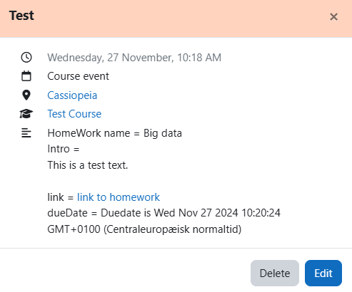

# Homework Block #

This plugin adds a homework block to the dashboard, displaying homework assignments for users.
It also includes a feature to view homework for a given coruse event in the calendar.
Additionally, it offers a map feature that provides a link to a location of an  within the calendar.

## Structure ##

The plugin relies on the <code>mod/homework</code> plugin to enable most of its functionalities.

The map links utilizes Google Map URLs. For more information, visit: <https://developers.google.com/maps/documentation/urls/get-started/>

## installation of Homework Block ##

The plugin can be also installed by putting the contents of this directory to

    {your/moodle/dirroot}/blocks/homework

Afterwards, log in to your Moodle site as an admin and go to Site administration >
Notifications_ to complete the installation.

Alternatively, you can run

    $ php admin/cli/upgrade.php

to complete the installation from the command line.

## Example of Usage ##

### Homework Block ###
To use the homework block, it needs to be added to the dashboard in edit mode.
Once in edit mode, add the block to the desired location and select <code>Homework</code>:

Thereafter, the block should display information from all courses relevant to the current user:

It is also possible to save homework time by using the <code>Time</code> button for a specific homework task on the homework block:

### Calender Event ###
To view the added information in calendar events, the homework block must be added to the dashboard.
This can be done by entering edit mode, adding the block to the desired location, and selecting <code>Homework</code>:

When creating an event, select a course to use the added features.
If a location is specified for the event, the plugin will automatically add the link to the location.

If the event is linked to homework, the associated homework will be displayed within the event:

## License ##

2024 PV

This program is free software: you can redistribute it and/or modify it under
the terms of the GNU General Public License as published by the Free Software
Foundation, either version 3 of the License, or (at your option) any later
version.

This program is distributed in the hope that it will be useful, but WITHOUT ANY
WARRANTY; without even the implied warranty of MERCHANTABILITY or FITNESS FOR A
PARTICULAR PURPOSE.  See the GNU General Public License for more details.

You should have received a copy of the GNU General Public License along with
this program.  If not, see <https://www.gnu.org/licenses/>.
