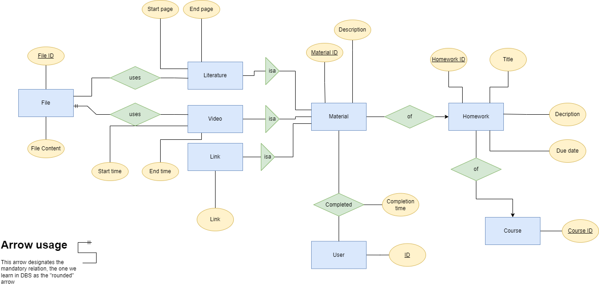
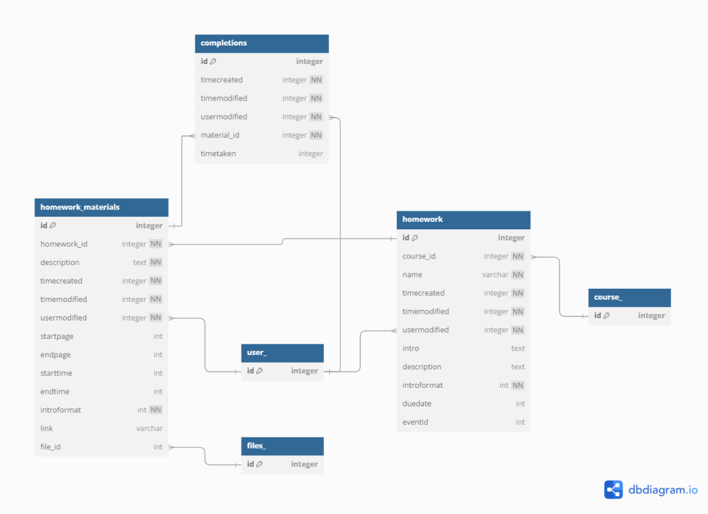
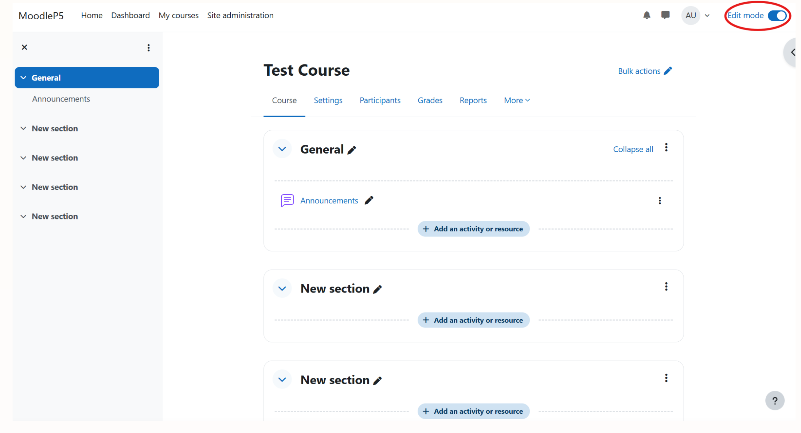
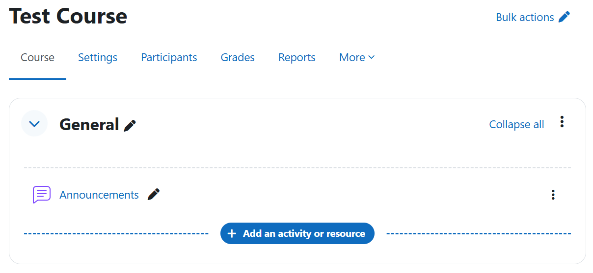
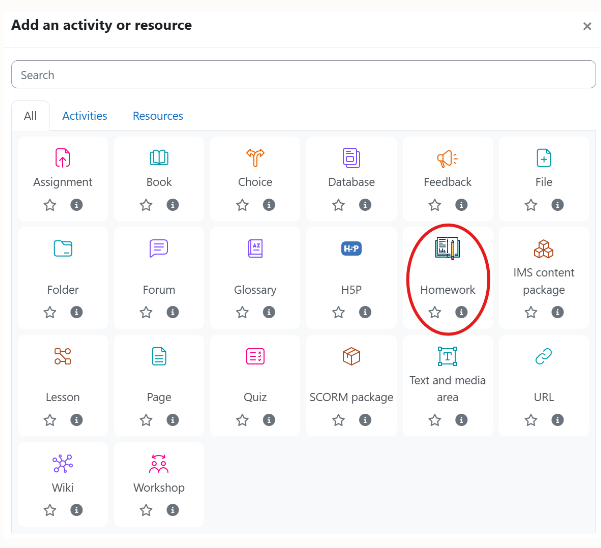
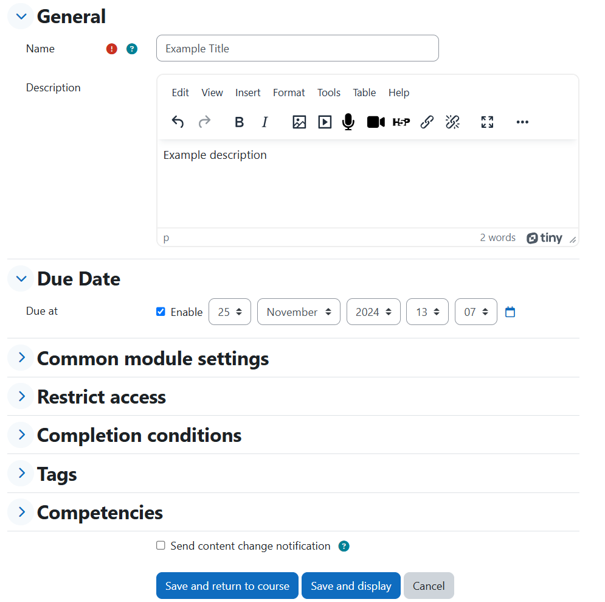
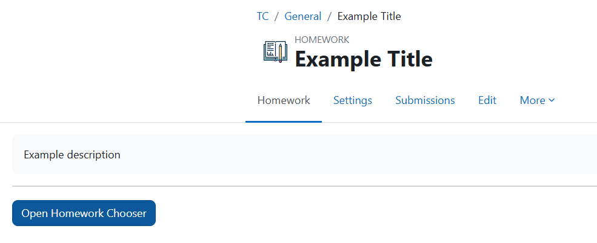
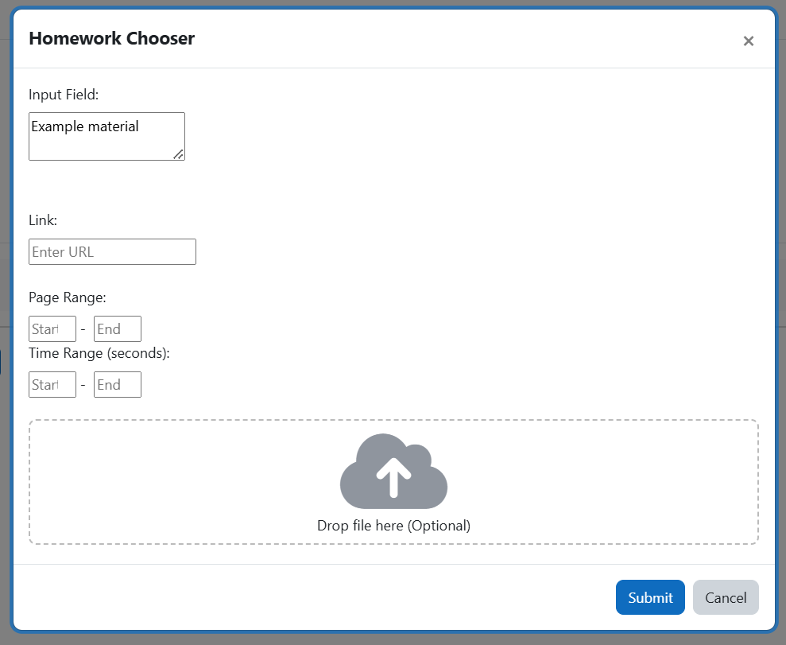

# Homework Activity Module #

This plugin adds a new activity resource as an option which can be 
added to a course section.

This plugin works as a framework for the creation of homework in a course section.
The homework should be created by teachers and be displayed to the enrolled students of a course.
The teachers can add different homework material, such as literature, links and videos, to the homework activity.
The homework can also include a due date and a description of the homework. 

## Database Structure ##

When installing the homework activity module the database is set up.
The database structure is defined by the following ER-diagram: 

And database tables are constructed based on the following relational schema:

The table names ending with underscore are Moodle core tables that have not been altered, 
but have been used to create a relation to the new tables.

## Installation ##

### Installing via Uploaded ZIP file ###

1. Log in to your Moodle site as an admin and go to _Site administration >
   Plugins > Install plugins_.
2. Upload the ZIP file with the plugin code. You should only be prompted to add
   extra details if your plugin type is not automatically detected.
3. Check the plugin validation report and finish the installation.

### Installing Manually ###

The plugin can be also installed by putting the contents of this directory to

    {your/moodle/dirroot}/mod/homework

Afterwards, log in to your Moodle site as an admin and go to  Site administration >
Notifications_ to complete the installation.

Alternatively, you can run

    $ php admin/cli/upgrade.php

to complete the installation from the command line.

## Usage ##
Step 1: On the course page turn on 'Edit mode'.

Step 2: Click on the 'Add an activity or resource' button.

Step 3: Select the 'Homework' activity.

Step 4: Insert the name and description for the homework. 
You can also enable a due date for the homework if needed and save the homework.

The course page should now contain your homework:

### Adding Material to the Homework ###
Step 1: To add material to the homework first open the homework by clicking on the homework.

Step 2: After opening the homework click on the 'Open Homework Chooser' button.

Step 3: Insert the name of the homework and add information regarding the homework. 
After inserting the necessary information click on the 'Submit' button.

## License ##

This program is free software: you can redistribute it and/or modify it under
the terms of the GNU General Public License as published by the Free Software
Foundation, either version 3 of the License, or (at your option) any later
version.

This program is distributed in the hope that it will be useful, but WITHOUT ANY
WARRANTY; without even the implied warranty of MERCHANTABILITY or FITNESS FOR A
PARTICULAR PURPOSE.  See the GNU General Public License for more details.

You should have received a copy of the GNU General Public License along with
this program.  If not, see <https://www.gnu.org/licenses/>.
